# HackRF-Display-mount
3D printable Display-mount for HackRf and Wideband-Antenna. Created with Rhino 6.
You can just mount the HackRf One to the backside of your Laptop-Display.

There are two Versions of the Case. The second one has a additional Slot to place 
a LNA-Wideband-Amplifier to it. 

Requirements:
* 3D printer 
* Filament of your choice

## View

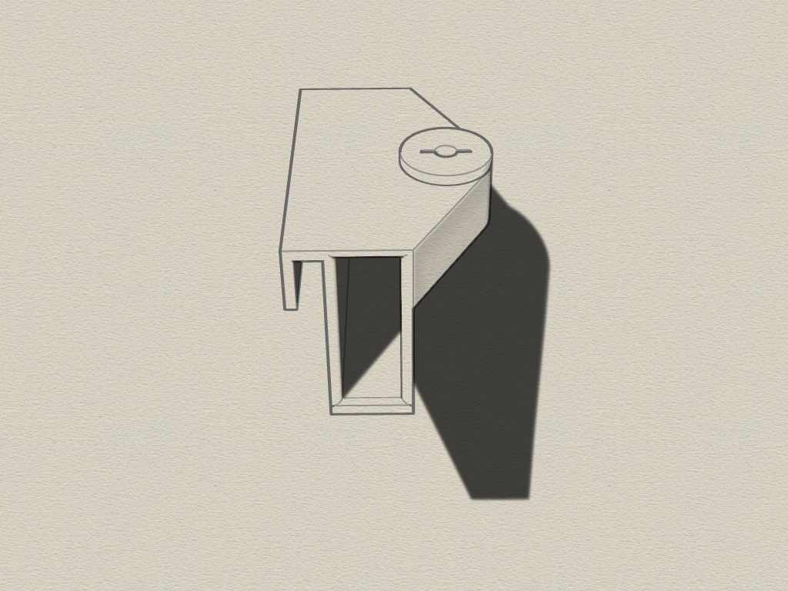 
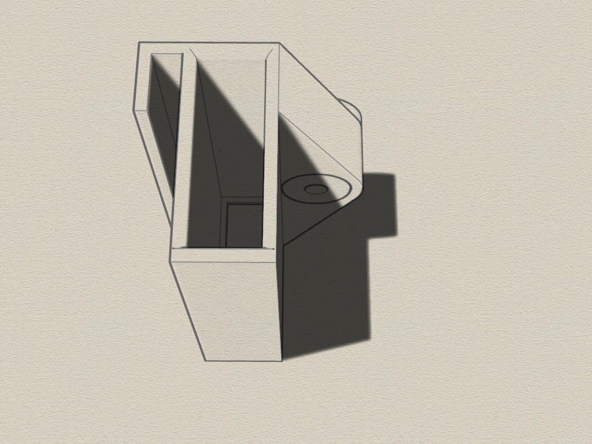
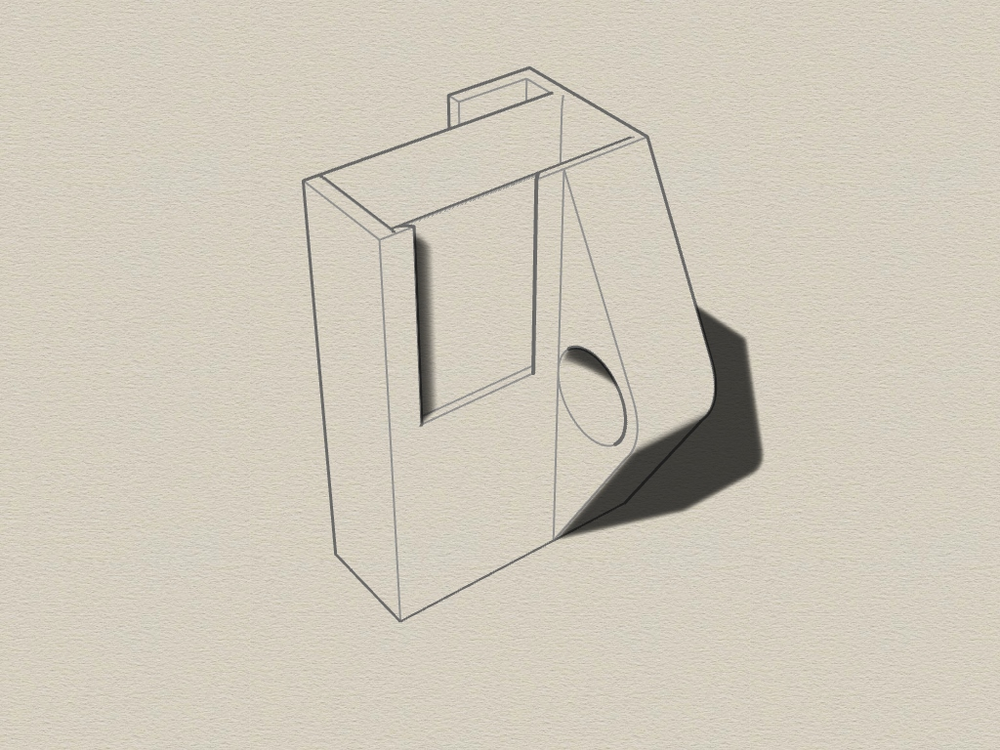

  

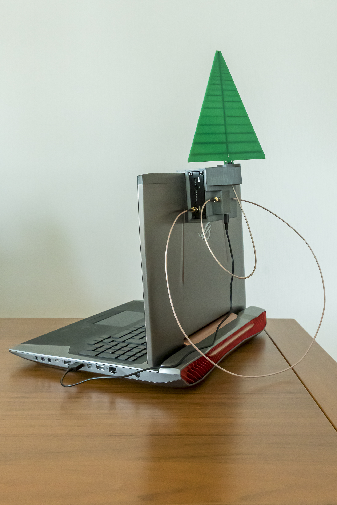 
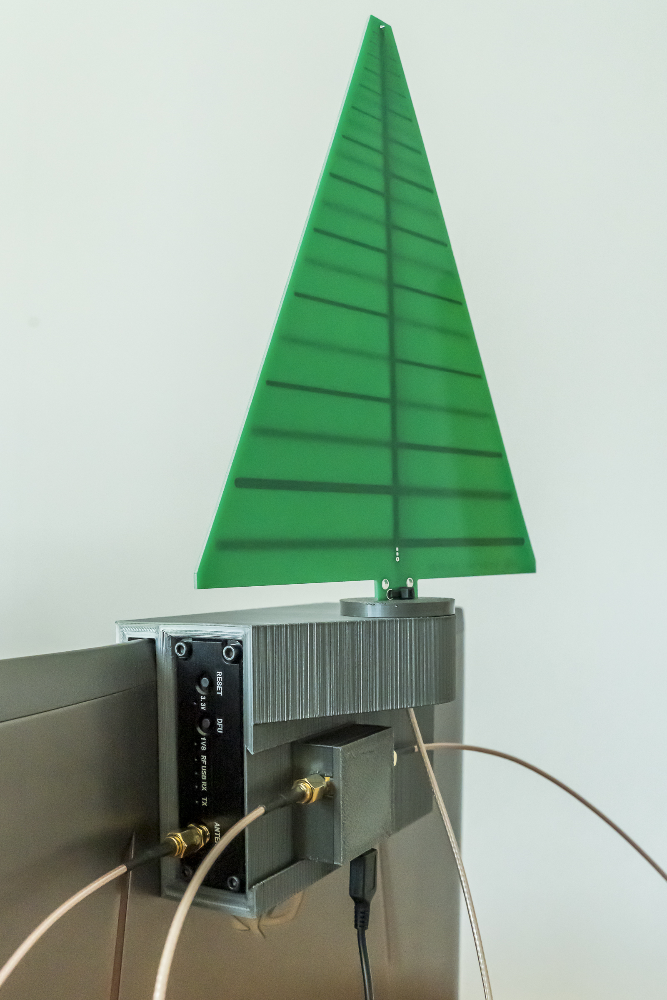 
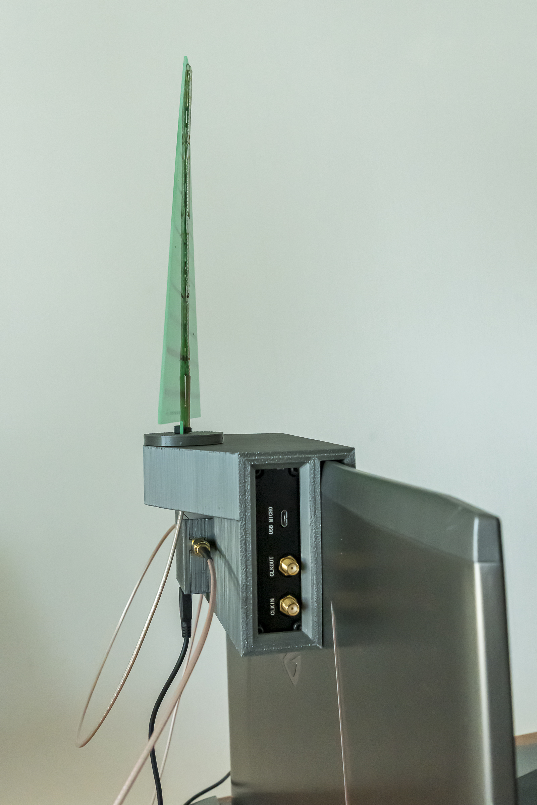 

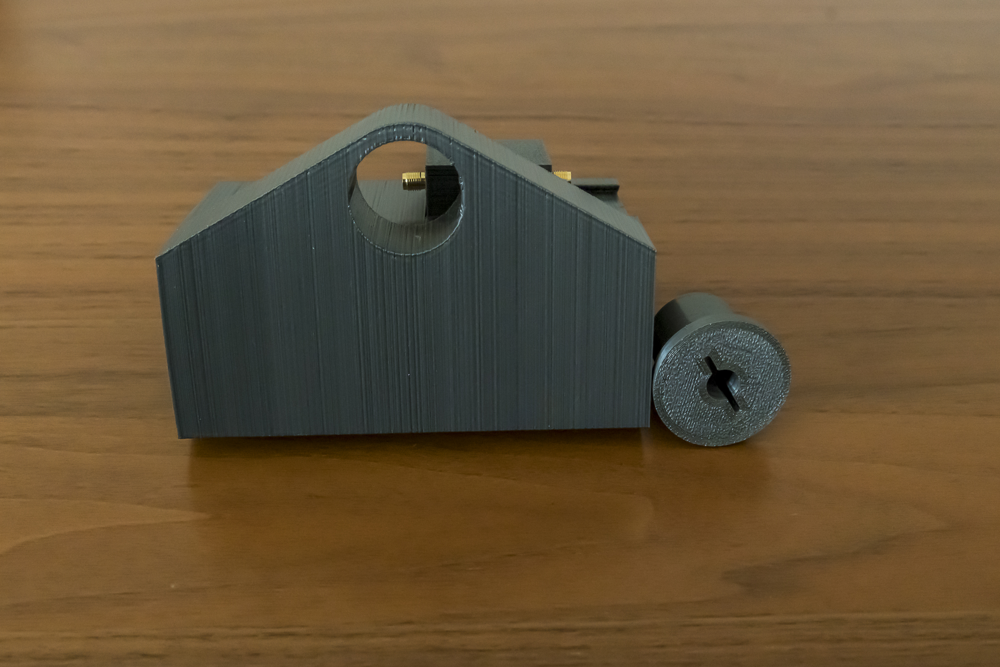 
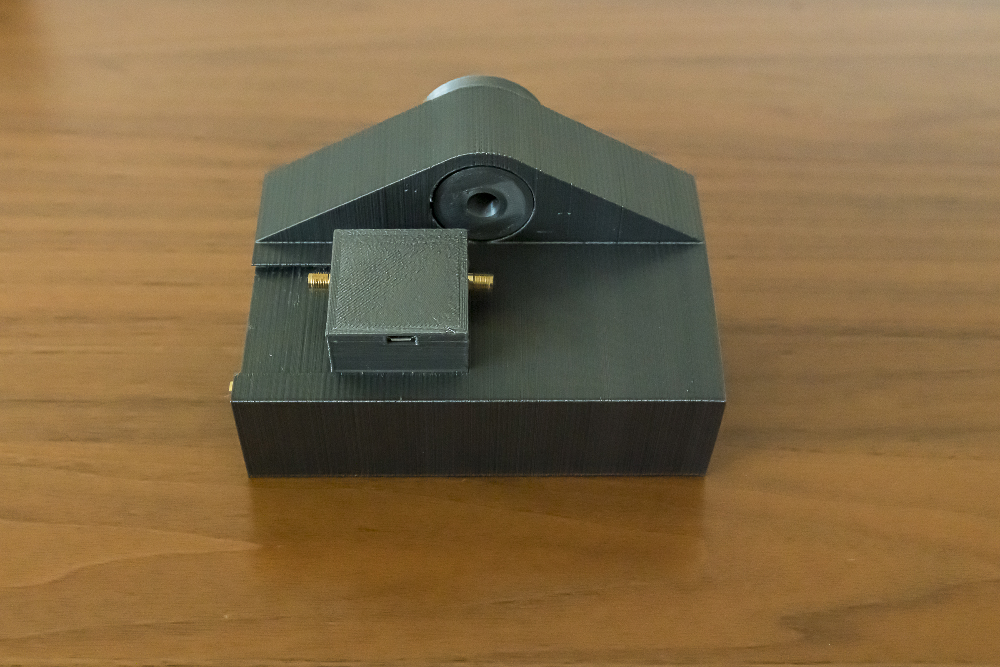 
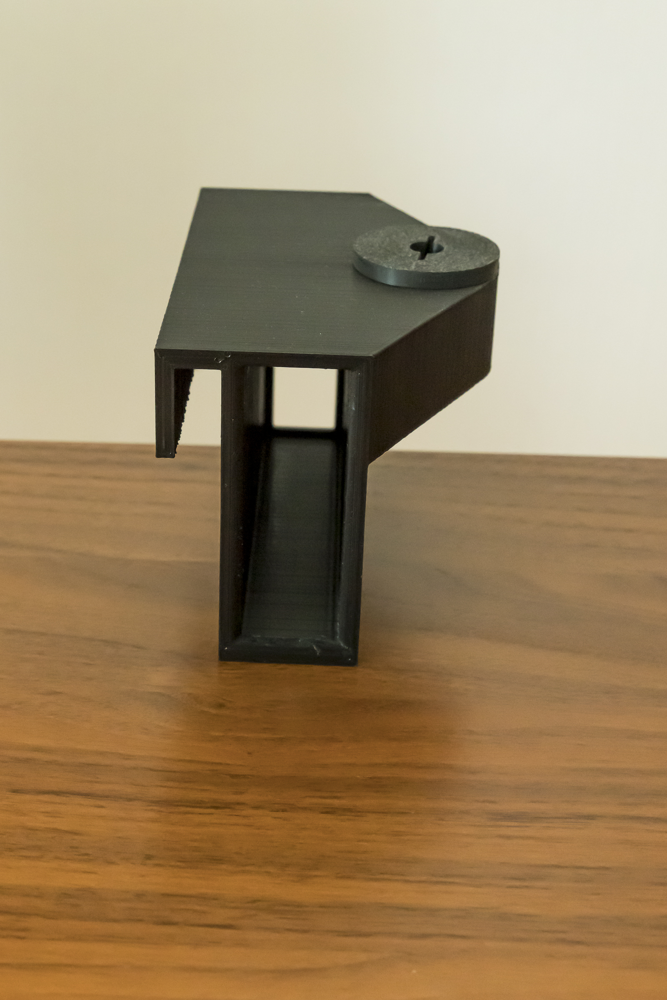 

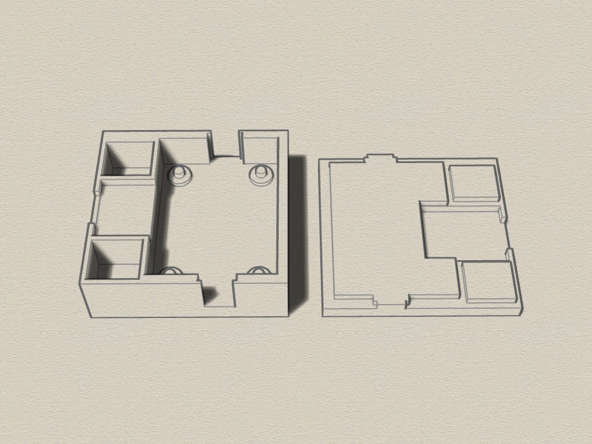 
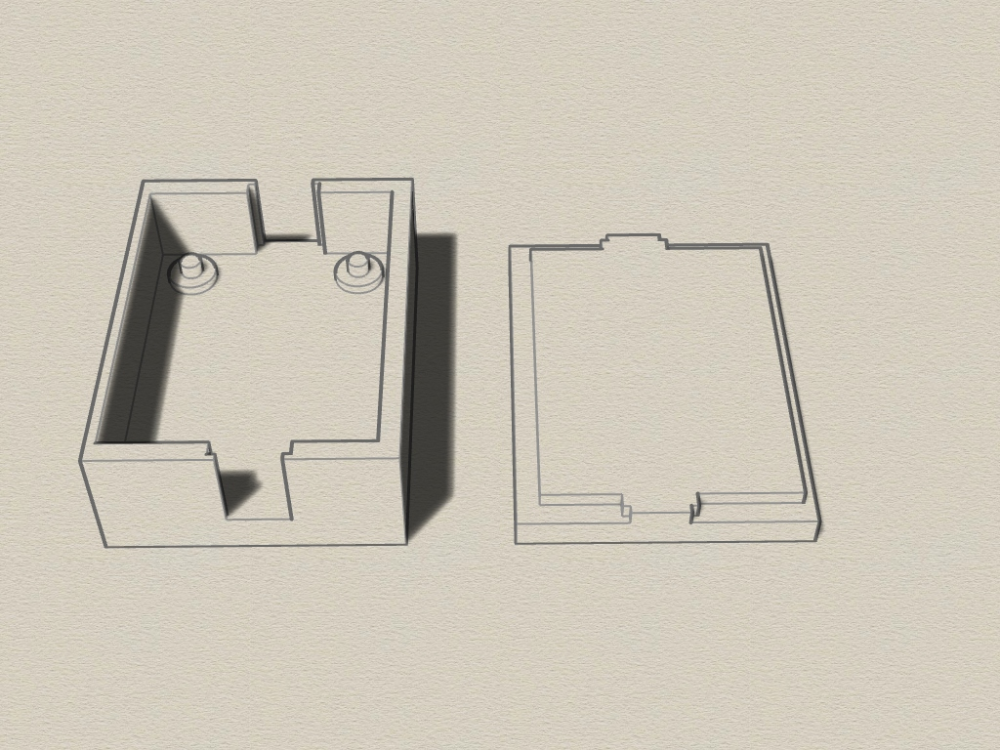 

